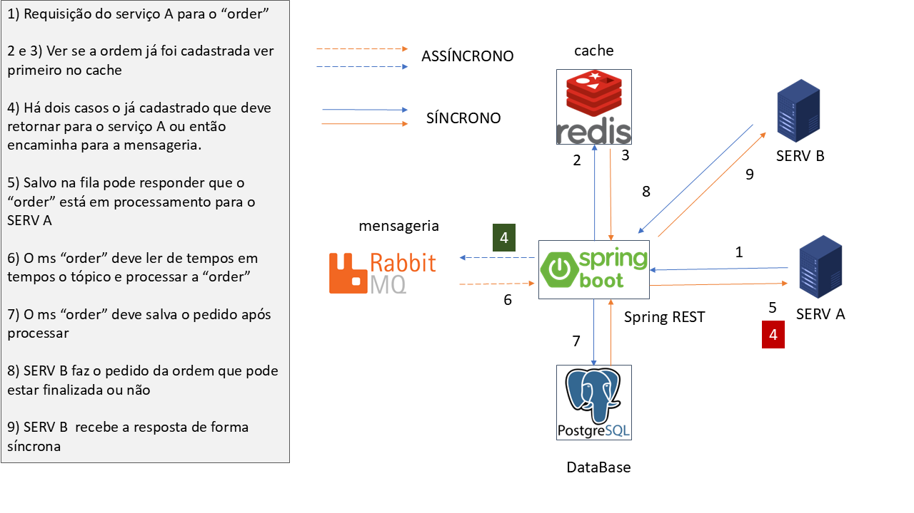

# Solução e arquitetura propostas

## Order Service API
Este é um microsserviço construído com Spring Boot para o gerenciamento de pedidos. Ele recebe requisições de pedidos, processa-os e disponibiliza o status para consulta.

Tecnologias Empregadas:

* Spring Boot
* Java
* Spring Data JPA
* PostgreSQL
* RabbitMQ
* Redis
* Swagger (OpenAPI)
* Docker

### Funcionalidades Principais:

* Recebimento de requisições de novos pedidos.
* Validação e persistência dos dados do pedido.
* Processamento assíncrono dos pedidos através do RabbitMQ.
* Cálculo do valor total dos pedidos.
* Verificação de duplicidade de pedidos utilizando Redis.
* Disponibilização do status dos pedidos para consulta.
* Documentação da API através do Swagger.

Próximos Passos Seriam:

Implementação de testes de integração.
Adição de mecanismos de monitoramento e logging mais avançados.
Implementação de estratégias de escalabilidade horizontal.
